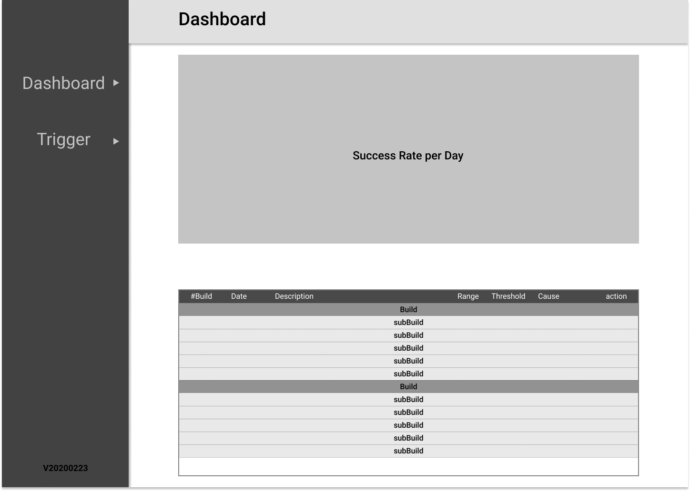
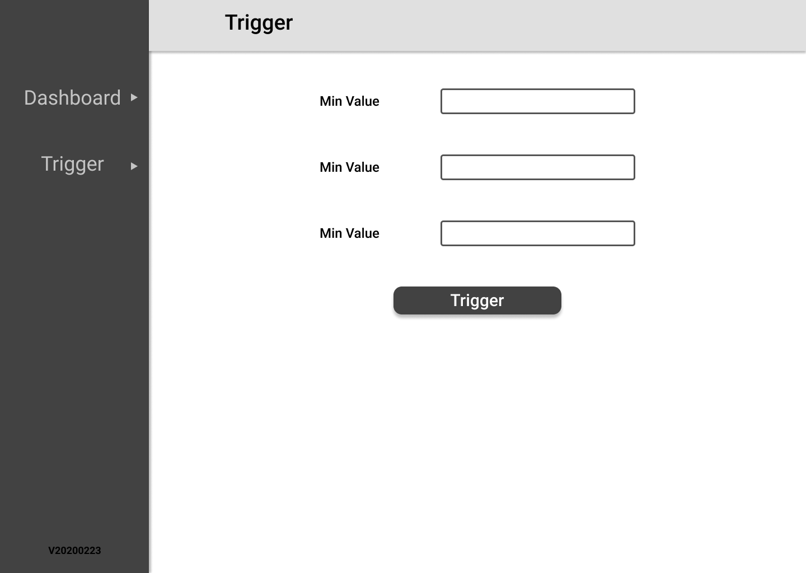

# DjangoJenkinsTraining

### Goals
- [ ] Learn Django framework.
- [ ] Learn Django-rest framework.
- [ ] Learn Jenkins API.
- [ ] Create tables using JQuery datatables.
- [ ] Create Charts using Highchart
- [ ] create crawlers using Celery Tasks

## Overview:
There is a pipeline in jenkins that run 5 tests, each test selects a random number and compares it to a threshold to determine success.

The app will crawl the jenkins server for the job results, and display them in a dashboard, detailing the build statistics for the last 7 days.

The app will also allow the user to manually trigger builds, provided range of the random value and a threshold.

## Jenkins Jobs
[Jenkins Server](http://35.157.133.88:8080/)

### random-number-check
[random-number-check](http://35.157.133.88:8080/job/mock/job/random-number-check/)

The job runs the script **devops/random_number.py**, which selects a random number and checks if its greater than a threshold, resulting in the following cases:
* rand > threshold -> SUCCESS
* elsewise -> FAILURE

### run_tests
[run_tests](http://35.157.133.88:8080/job/mock/job/run_tests/)

The job is triggered periodically every hour, the job takes parameter of the minimum, maximum and threshold values, and passes them to **random-number-check**. The job runs **random-number-check** five times, and has **random-number-check** as its subBuild.

## Views

### Dashboard

This dashboard will show statistics about **run_tests jenkins job**, it will show the builds of the last 7 days, displaying the success rates in a chart and the build details in table.

#### Chart
This chart will show the aggregate success rate for each day in last 7 days.

##### requirements:
* Line chart
* Average success rate on the Y axis
* Date should be X axis

#### Table
This table will show the details of the **run_tests jenkins job**, it will contain every build in the last 7 days, it also displays the infomation about each of the subBuilds for a given build.

##### requirements
* The table should show
    1. Build number, which should be a link back to the build in jenkins.
    2. The Date and time the job was triggered
    3. The Description of the build.
    4. Range of min and max value for the random number
    5. The threshold used to determine success
    6. The cause of the trigger.
    7. The success rate of the build, this should be blank in the case of hte subbuilds.
    8. Actions contains a icon button that retriggers the build.

### Trigger

This view will allow the user to manually trigger a build for **run_tests jenkins job**, allowing the user to determine the min and max values and threshold.

